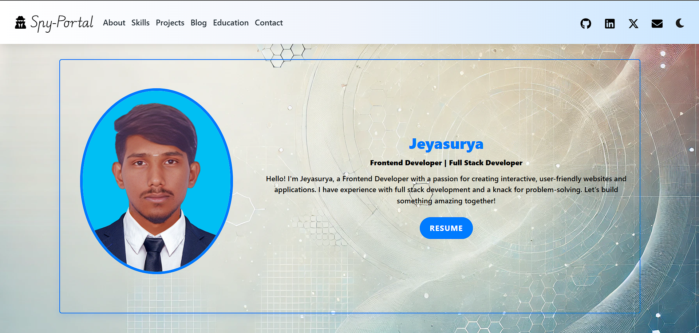
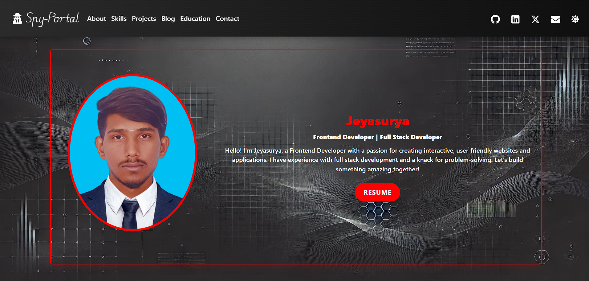

# Personal Portfolio Website

A modern, responsive personal portfolio website built with **React.js**, featuring a dynamic dark/light theme switcher and smooth animations to showcase your skills, projects, and experience.

---

# Screenshots

## Light Theme


## Dark Theme


---

## 🌟 Features

- **Responsive Design**: Adapts seamlessly to desktops, tablets, and mobile devices.
- **Theme Toggle**: Dynamic dark and light theme switching for user customization.
- **Smooth Animations**: Subtle animations with clean transitions and hover effects.
- **Social Media Integration**: Animated icons linked to your social media profiles.
- **Modern UI**: Contemporary design with gradient backgrounds, box shadows, and a professional look.
- **Section Components**:
  - Navigation Bar
  - About Me Section
  - **Education Section**: Showcase your educational background.
  - Skills Section
  - Projects Section
  - Contact Form
  - Footer

## 🚀 Technologies Used

- **React.js**: Frontend library for building the user interface.
- **React Bootstrap**: For responsive layout and components.
- **CSS3**: For styling and animations.
- **React Icons**: For scalable vector icons.
- **EmailJS**: For sending emails directly from the portfolio (e.g., contact form).
- **React Router**: For routing and navigation between pages.

## 📦 Installation

Follow these steps to get the project running on your local machine:

1. **Clone the repository**:
   ```bash
   git clone https://github.com/Jeyasurya23/portfolio.git
   ```

2. **Navigate to the project directory**:
   ```bash
   cd portfolio
   ```

3. **Install dependencies**:
   ```bash
   npm install
   ```

4. **Start the development server**:
   ```bash
   npm start
   ```

## 🛠️ Available Scripts

- `npm start`: Runs the app in development mode.
- `npm test`: Launches the test runner.
- `npm run build`: Builds the app for production.
- `npm run eject`: Ejects from Create React App (use with caution).

## 📂 Project Structure

```
├── public/
│   ├── index.html
│   └── ...
├── src/
│   ├── components/
│   │   ├── Navbar/
│   │   ├── About/
│   │   ├── Skills/
│   │   ├── Project/
|   |   ├── Certificate/
|   |   ├── Blog/
│   │   ├── Education/
│   │   ├── Contact/
│   │   └── Footer/
│   ├── assets/
│   │   ├── certificate/
│   │   └── ...
│   ├── App.js
│   └── index.js
└── package.json
```

## 🎨 Customization

### Themes
The website supports two themes:
- **Light Theme**: Bright, clean layout with blue accents.
- **Dark Theme**: Modern dark mode with red accents.

### Styling
- Custom CSS with smooth transitions.
- Gradient backgrounds for a modern aesthetic.
- Hover effects for interactive elements.
- Responsive design that works seamlessly across various devices.
- Box shadow effects for depth and separation.

## 📱 Responsive Design

The portfolio is fully responsive across different device breakpoints:
- **Mobile**: < 576px
- **Tablet**: 576px - 768px
- **Laptop**: 768px - 992px
- **Desktop**: > 992px

## 🔧 Configuration

To customize the portfolio:
1. Update personal details such as your bio and contact information in the respective components.
2. Modify the color schemes and styles in the `CSS` files for both light and dark modes.
3. Add or remove sections as required based on your needs.
4. Update social media links in the `social-icons` component.

## 📄 License

This project is licensed under the MIT License. See the [LICENSE](./LICENSE) file for details.

## 📞 Contact

For any queries or suggestions, feel free to contact me:
- **Email**: [your.jeyasurya0100@gmail.com](mailto:your.jeyasurya0100@gmail.com)
- **LinkedIn**: [jeyasurya-g](https://www.linkedin.com/in/jeyasurya-g)
- **GitHub**: [jeyasurya23](https://github.com/jeyasurya23)

## 🙏 Acknowledgments

- Thanks to the **Create React App** team for providing the boilerplate.
- Grateful to the **React Bootstrap** community for the responsive components.
- Special thanks to the **React Icons** library for scalable icons.
- To all the **open-source contributors** who help improve the development ecosystem.

